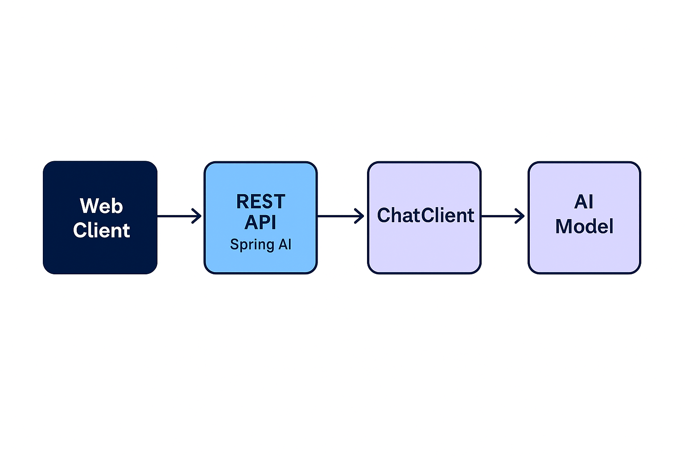

# 🧠 Spring AI Customer Support Demo

This project is a **Spring Boot + Spring AI** integration that connects a backend API to OpenAI’s GPT-4o model for both **text-based** and **multimodal (image + text)** AI responses.  
It demonstrates how to create intelligent endpoints using Spring AI’s `ChatClient`, send prompts to models, and handle responses programmatically.

---

## 📸 Architecture Overview



**Flow Summary:**
1. **User** (via Postman or Web App) sends a request to `/chat` or `/chat/chat-with-image`.
2. **Spring Boot Controller (`TestController`)** receives the request.
3. **Spring AI ChatClient** builds a structured prompt (system + user messages).
4. **OpenAI GPT-4o Model** processes the request and generates a response.
5. **ChatClient** returns the AI output to the controller.
6. **Controller** sends the formatted response back to the user.

---

## ⚙️ Features

- **Text Chat Endpoint**
    - URL: `GET /chat`
    - Accepts a query parameter `msg`.
    - Example:
      ```bash
      http://localhost:9090/chat?msg=What+is+Spring+AI
      ```
    - Returns a concise AI-generated response.

- **Image + Text Endpoint**
    - URL: `GET /chat/chat-with-image`
    - Accepts:
        - `message` (text)
        - `image` (file)
    - Example usage in Postman (form-data):
      | Key | Type | Value |
      |------|------|--------|
      | message | Text | Describe the image |
      | image | File | your_image.png |

---

## 🧩 Technologies Used

- **Spring Boot** – REST API Framework
- **Spring AI** – Integration for OpenAI models
- **OpenAI GPT-4o** – Text and image understanding model
- **Maven** – Dependency Management
- **Postman** – API testing client

---

## 🧠 What’s Being Tested

This project focuses on verifying the **end-to-end connection between Spring AI and GPT models**:

- ✅ Spring Boot’s REST controller handling for text and file input
- ✅ ChatClient configuration for OpenAI API calls
- ✅ Response parsing and output formatting
- ✅ Error handling for invalid keys, missing parameters, and API timeouts
- ✅ Integration of `@RequestPart` and `MultipartFile` for multimodal input

---

## 🧪 How to Run Locally

1. **Clone the project:**
   ```bash
   git clone https://github.com/your-username/AI_Customer_Support.git
   cd AI_Customer_Support

2. **Add your OpenAI API key in application.properties:**
    ```bash
    spring.ai.openai.api-key=sk-yourkeyhere
    server.port=portnumberhere


3. **Run the project**
    ```bash
    mvn spring-boot:run
4. **Author Notes**
    ```bash
   This project was used to experiment and debug Spring AI integrations — testing both text and image endpoints, validating OpenAI key configuration, and understanding the internal ChatClient call flow.
   

